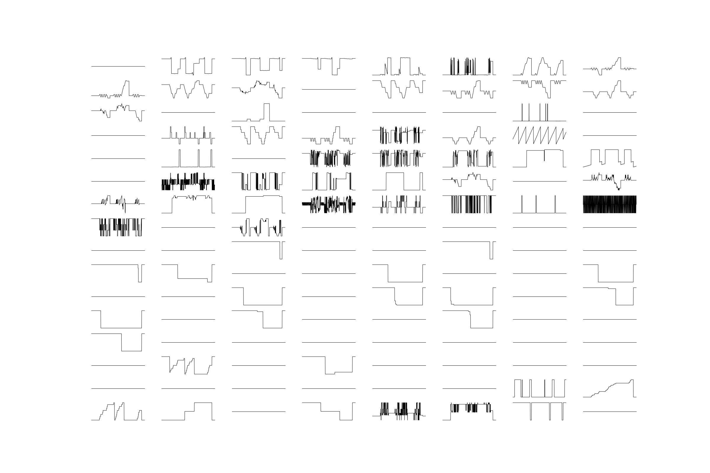

# Atari Sparklines



<p align="center"><i>First ten seconds of MsPacman</i></p>

Inspired by [this](https://twitter.com/FogleBird/status/1087557351211704320) tweet.

Code to get a sparklines plot from the RAM values of an Atari game.

## Usage

Run `python atari_sparklines.py` to, by default, get the sparklines plot of the RAM values for the first ten seconds of MsPacman and save them to `sparklines.png`.

The values of RAM for every frame are plotted. There are 60 frames-per-second. At each frame, a random action is taken, i.e. a random button on the Atari controller is pressed.

## Arguments

`python atari_sparklines.py --game SpaceInvaders`, gets the RAM values for Space Invaders

`python atari_sparklines.py --n_frames 600`, gets the first 600 frames (10 seconds)

`python atari_sparklines.py --n_rows 16 --n_cols 8`, layout of the sparklines plot in the figure (this must equal the number of RAM values, which should always be 128)

`python atari_sparklines.py --fig_width 24 --fig_height 16`, width and height of the figure

`python atari_sparklines.py --color black --line_width 0.7`, color and thickness of the sparklines

`python atari_sparklines.py --fig_name sparklines`, name of the saved figure (which has the .png extension appended)

## Requirements

```
python 3.6+
gym
matplotlib
numpy
```